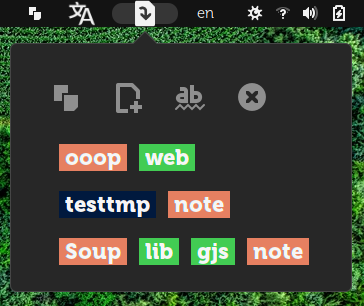

# gnome-shell-clip-note

- Save clip contents (`ClipboardType.PRIMARY` means mouse selected text) to multiple notes with separate tags.
- Notes locate at `~/.local/share/clip-note/`. *You can soft link this directory to anywhere as you wish.*
- Dots in filename means splited tags.
- This extension just moves my bash script [y](https://github.com/eexpress/bin/blob/master/y) to the GUI interface.
- 4 Function Buttons: Copy to file, Open Dir, Add new file, Refresh list.
- Operating instructions
    - First button is `Copy Clip to file below`, this is default function, no need to click.
    - Mouse select text anywhere, Open extension menu, Click one file name in list directlly, selected text will paste into the file.
    - Click `Add a New File` button, input filename as you wish. The dots in the file name will split the file name into colored tags. If you can cancel, just click first button. Those files is virtually added, if you do not copy content to file, press `refresh` button will clear them.
    - `Refresh file list` button is refresh actual exist files in note path. `Open Note Directory` means it is.
- I wonder if file operations such as *open / rename / delete* should be done by my extension.
- My 3rd JS program. Work in constant Guess.



```
⭕ tree ~/.local/share/gnome-shell/extensions/clip-note@eexpss.gmail.com
├── clip-note-symbolic.svg
├── extension.js
├── metadata.json
└── stylesheet.css
```
